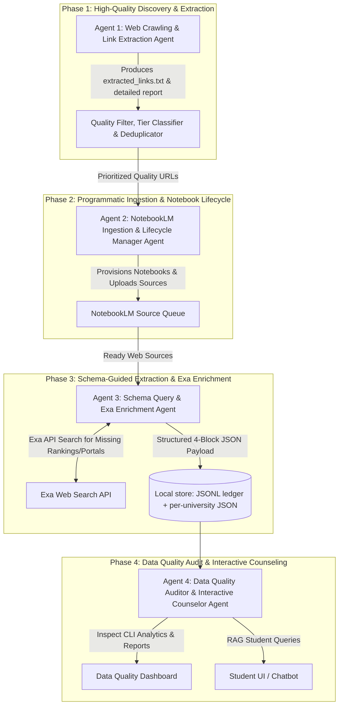

# Education Counselor Multi-Agent RAG System Architecture (AGENTS.md)

This document outlines the multi-agent system architecture designed to collect, process, index, and retrieve official university guidance data for the **AI Education Counselor System**.

---

## Master Architecture Overview

---

## Agent Specifications & Responsibilities

### Agent 1: Web Crawling & Link Extraction Agent (`extract_links.py`)
* **Role**: Primary discovery and link sanitization agent for HEC-recognized universities and high-value sub-pages.
* **Execution Modes**:
  - **Standalone CLI**: Can be run independently (`python3 extract_links.py --url ...` or `--hec`).
  - **Automated Pipeline**: Executed automatically as Phase 1 in the end-to-end master pipeline.
* **Responsibilities**:
  - Discover official recognized universities from the Higher Education Commission (HEC) directory.
  - Execute Crawl4AI `BestFirstCrawlingStrategy` across target university domains.
  - Enforce strict **Zero Garbage Policy** (strip portals, logins, tenders, job posts, legal disclaimers, static assets).
  - Filter out news and event links via `--exclude-keywords "news|events"`.
  - Apply 2026 recency score boosting via `--uptodate true`.
  - Perform **Canonical Degree Deduplication** (`deduplicate_canonical_degree_links_async`) using fast token sets coupled with Jev `Noul` entity alignment (`are_duplicate_degree_variants_jev`) to merge multi-campus subdomain mirrors, annual intake variants, and acronym synonyms (e.g. BS CS vs BS Computer Science).
  - Apply **Jev System One Speculative Fan-out** (`classify_and_score_links_jev`) using batched `Choice` (priority tiering) and `Noul` (counseling relevance probability) to classify 25-30 candidate links concurrently without loading local PyTorch tensors.
  - Export dual text outputs: `extracted_links.txt` (URLs only) and `extracted_links_detailed.txt` (Full metadata breakdown).

---

### Agent 2: NotebookLM Ingestion & Lifecycle Manager Agent (Phase 2)
* **Role**: NotebookLM workspace provisioning and batch source ingestion agent.
* **Responsibilities**:
  - Provision isolated NotebookLM notebooks per university (`notebooklm create "UniName_Counseling_DB"`).
  - Manage Pro account quotas (300 sources per notebook, 500 queries per day).
  - Batch upload URLs from the per-university partition (`data/links/<slug>.jsonl`) into NotebookLM sources, over a shared HTTP/2 connection pool.
  - Monitor processing readiness **per source**, with jittered exponential backoff and failure isolation: a source that times out or errors is reported as not-ready without discarding the sources that did succeed, so the notebook remains queryable against its ready corpus.
  - Persist the `url -> source_id -> tier` map to SQLite so Agent 3 can scope each query with `source_ids`.
  - Automatically delete notebooks after JSON extraction to clear workspace slots while preserving raw link files and JSON outputs.

---

### Agent 3: Schema Query & Exa Enrichment Agent (Phase 3)
* **Role**: Schema-guided query extraction, Exa API fallback, and Jev grounding verification agent.
* **Responsibilities**:
  - Execute a 5 to 6 targeted query suite per university against NotebookLM using strict JSON schema prompt files:
    - **Q1**: `main_info` (Metadata, Rankings, Academics/Admissions/Application Portal URLs).
    - **Q2**: `programs.bachelors` (BS, BSc, BA, BBA, MBBS, LLB, PharmD, DPT with full-paragraph descriptions, fees, eligibility, admission requirements, deadlines).
    - **Q3**: `programs.masters` (MS, MSc, MA, MBA, MPhil, LLM with full-paragraph descriptions, fees, eligibility, admission requirements, deadlines).
    - **Q4**: `programs.phd` (research doctorates only; post-doctoral fellowships are excluded).
    - **Q4b**: `programs.diploma` (postgraduate diplomas, PGDs, certificates) — added in C17.
    - **Q5**: `faculties` (Faculties, Schools, and constituent departments).
    - **Q6**: `contact` (Emails, phone numbers, physical address, admissions desk).
  - Reserve the suite against the 500/day NotebookLM budget **before** issuing any query, refusing to start a university that cannot complete within the remaining allowance.
  - Enforce the **Jev Grounding & Citation Verification Gate** (`src/extractor/crawlers/verification.py`): verify high-risk extracted claims (`tuition_fee`, `eligibility_requirements`, `application_deadlines`) against source text using Jev `Noul` ($p \ge 0.75$), nullifying ungrounded claims to maintain the strict zero-hallucination policy.
  - Trigger **Exa API web search fallback** if ranking data or application portal URLs are missing from NotebookLM sources.
  - Assemble complete 4-block JSON payload and append to the fsynced append-only ledger `university_counseling_data.jsonl`. The master JSON array is aggregated separately in one streamed pass at the end of a run, never per-university.

---

### Agent 4: Data Quality Auditor & Interactive Counselor Agent (Phase 4)
* **Role**: Data health analytics, inspection, and conversational counseling agent.
* **Responsibilities**:
  - Execute the **Inspector** (`cli.py`, `src/inspector/`) to audit dataset health:
    - Unique university count and type distribution (Public vs Private).
    - Total program breakdown (Bachelors, Masters, PhD, Diploma counts).
    - Empty and NaN field audit across all 4 blocks.
    - Application portal link coverage and completeness rankings.
  - Provide **Semantic Counselor Search & Intent Routing** (`src/inspector/semantic_search.py`):
    - Parse natural language student inquiries (e.g., *"Affordable AI masters in Lahore"*) into typed intent filters using Jev `Choice`.
    - Semantically rerank candidate programs using Jev `Score` along a 0–5 calibrated rubric, scoring exact counseling fit.

---

## Module Map

The four agents above are implemented as packages under `src/`, sequenced by
`src/orchestrator.py`, which holds no logic of its own:

| Agent | Package | Entry point |
| :--- | :--- | :--- |
| 1 — Crawling & link extraction | `src/extractor/linkers/` | `run_pipeline()` |
| 2 — Ingestion & notebook lifecycle | `src/ingestor/` | `ingest_university_sources()` |
| 3 — Schema query & enrichment | `src/extractor/crawlers/` | `extract_university_payload()` |
| 4 — Quality audit & inspection | `src/inspector/` | `cli.py`, `audit_corpus()` |

Shared, dependency-free leaf layer: `src/utilities/` (schema, state, JSON I/O,
registry, naming, workspace, typesafe_client). Nothing in `utilities/` imports upward, and
nothing in `inspector/` imports the orchestrator at module scope — the
orchestrator may import the inspector, never the reverse.

### Standing rules the agents operate under

1. **Nothing is invented to fill a gap.** An unanswered field is null; the
   inspector's audit is what reports it. Identity facts and rankings come from
   `resources/rankings_global.json`, never from the model.
2. **Programmes are the primary target**, classified into exactly four levels:
   bachelors, masters, phd, diploma.
3. **Fees keep the currency the university published them in.** Currency is
   labelled, never converted.
4. **Quota is reserved before it is spent**, and a pre-flight health check can
   refuse a university before a notebook is created.
5. **Phase 3 queries one notebook serially.** Concurrent asks share a
   conversation and return each other's answers.
6. **TypeSafe Jev System One Primitives**:
   - Link relevance & deduplication: `Choice` (priority tiering) and `Noul` (entity duplicate alignment).
   - Citation & grounding verification: `Noul` ($p \ge 0.75$) eliminates hallucinated fees and deadlines.
   - Counselor search reranking: `Score` (0–5 rubric) ranks candidates by student constraint satisfaction.
   - Deterministic offline fallbacks ensure 100% test and pipeline operability even without API access.
