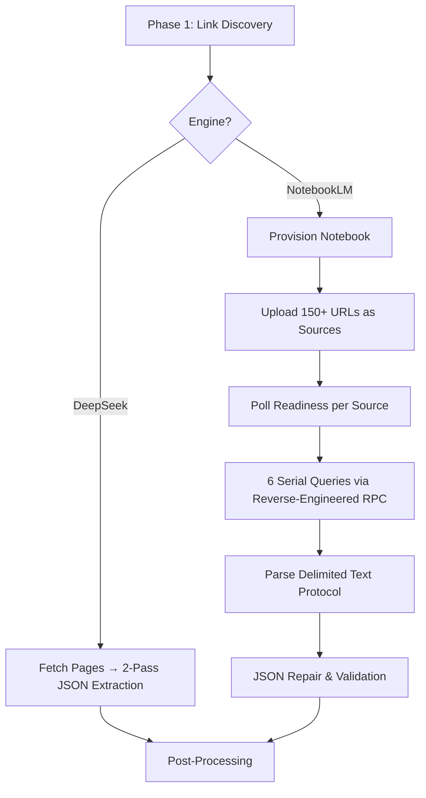
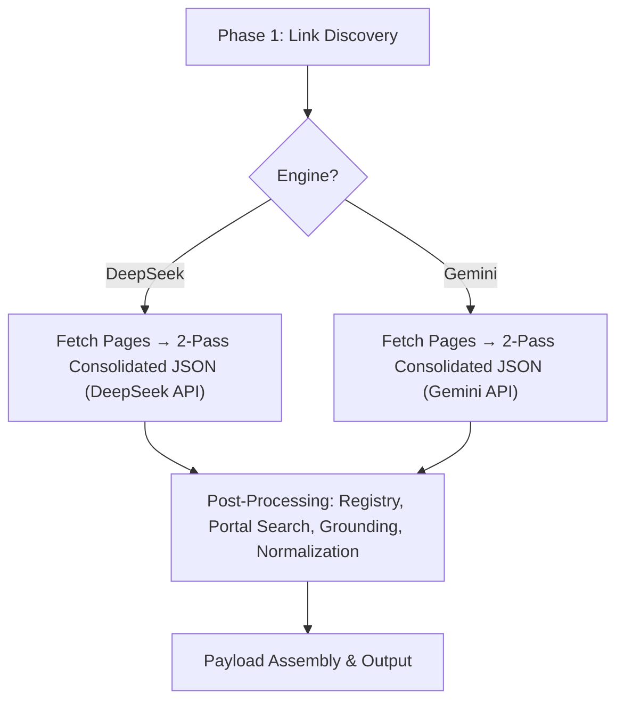

# Replace NotebookLM with Gemini API — Implementation Plan

## Goal
Replace the entire NotebookLM reverse-engineered backend (ingestor, notebook lifecycle, delimited text protocol, RPC buffer patches, cookie-based authentication) with the **official Google Gemini 2.0 Flash API** (`google-genai` SDK), creating a clean dual-engine architecture where both engines (DeepSeek + Gemini) follow the same direct extraction pattern: **scrape pages → prompt with schema → structured JSON**.

### Why This Matters
- NotebookLM requires **reverse-engineered session cookies** that expire and break overnight runs.
- NotebookLM has a **500 queries/day** hard ceiling, 200MB RPC buffer limits, and 1.5–3 minute ingestion wait per university.
- The Gemini API provides **3,000 free requests/day** (across 2 keys), native Pydantic schema enforcement, and completes extraction in **~5 seconds per university**.
- Both engines now share the same architecture: no ingestion, no notebooks, no cohort partitioning.

---

## User Review Required

> [!IMPORTANT]
> **Engine Name Change**: The `--engine notebooklm` CLI option will be replaced with `--engine gemini`. Any existing scripts or configs using `--engine notebooklm` will need to be updated.

> [!IMPORTANT]
> **Test Count Reduction**: Removing NotebookLM modules deletes ~124 tests (ingestor, text protocol, notebook querying, notebook logging). New Gemini tests add ~15–20. Final test count drops from **787 → ~680–700**. The deleted tests cover code that no longer exists, so there is zero coverage loss.

> [!WARNING]
> **`notebooklm-py` Dependency Removal**: The `notebooklm-py==0.7.3` package will be removed from `requirements.txt`. The `google-genai` package will be added. This changes the install surface.

---

## Open Questions

> [!IMPORTANT]
> **API Key Configuration**: Should the 2 Gemini API keys be configured as:
> - (A) A comma-separated env var `GEMINI_API_KEYS="key1,key2"`, or
> - (B) Two separate env vars `GEMINI_API_KEY_1="key1"` and `GEMINI_API_KEY_2="key2"`?
> 
> The plan uses option (A) as it's simpler and more extensible.

> [!IMPORTANT]
> **Model Choice**: Should we use `gemini-2.0-flash` (latest, 1M context) or `gemini-1.5-flash` (stable, 1M context)? The plan defaults to `gemini-2.0-flash` but this is configurable.

---

## Architecture: Before vs After

### Before (NotebookLM)


### After (Gemini)


> [!TIP]
> Both engines now follow an identical architecture. The only difference is which LLM API receives the prompt. This eliminates ~2,100 lines of NotebookLM-specific code.

---

## Proposed Changes

### Commit 1: Extract Shared Types + Add Gemini Client & Extractor (Additive Only)

This commit only **adds** new files and extracts shared types. Nothing is deleted. The existing NotebookLM code continues to work.

---

#### [NEW] `src/extractor/crawlers/query_schemas.py`

Extract the 4 shared types currently living in `notebook_querying.py` that both DeepSeek and Gemini need:

```python
"""
Shared query suite definitions, extraction report, and payload schemas.

Extracted from notebook_querying.py so both DeepSeek and Gemini engines
can import them without pulling in NotebookLM dependencies.
"""
from dataclasses import dataclass, field
from typing import Any, Dict, List, Optional, Set, Tuple
from pydantic import BaseModel

from src.utilities.schema import (
    ContactInfo, FacultyItem, MainInfo, ProgramItem,
)


class Q1Payload(BaseModel):
    """Combined identity + contact extraction (Query 1)."""
    main_info: MainInfo
    contact: ContactInfo


@dataclass
class QuerySpec:
    """One query in the suite, bound to source tiers."""
    key: str
    prompt: str
    model: Any
    tiers: Tuple[int, ...]
    fields: Optional[Any] = None      # FieldSpec tuple (NotebookLM text protocol)
    single: bool = False
    text_prompt: Optional[str] = None  # Generated delimited-text prompt


class ExtractionReport:
    """Tracks query success/failure across extraction blocks."""
    def __init__(self):
        self.succeeded: Dict[str, float] = {}
        self.failed: Set[str] = set()
        self.queries_used: int = 0
        self.consecutive_throttle_errors: int = 0

    def record_success(self, key: str, duration_sec: float = 0.0):
        self.succeeded[key] = duration_sec
        self.queries_used += 1
        self.consecutive_throttle_errors = 0

    def record_failure(self, key: str, reason: str = ""):
        self.failed.add(key)
        self.queries_used += 1

    @property
    def ok(self) -> bool:
        return len(self.failed) == 0


# The 6-query QUERY_SUITE is defined here with identical prompts
# (moved from notebook_querying.py, keeping all prompt text intact)
QUERY_SUITE: List[QuerySpec] = [
    # ... all 6 QuerySpec definitions (main_info_contact, bachelors,
    #     masters, phd, diploma, faculties) with their full prompts,
    #     models, and tier assignments ...
]
```

**Key detail**: The `QUERY_SUITE` prompts are copied verbatim from [`notebook_querying.py`](file:///home/huzaifayaqob/unicrawling/src/extractor/crawlers/notebook_querying.py). The `fields` and `text_prompt` attributes become dead for Gemini/DeepSeek but are kept to avoid changing the QuerySpec interface until NotebookLM is fully removed in Commit 3.

---

#### [MODIFY] `src/extractor/crawlers/deepseek_extractor.py`

Update the import to source from the new shared module:

```diff
- from src.extractor.crawlers.notebook_querying import (
+ from src.extractor.crawlers.query_schemas import (
      ExtractionReport,
      QUERY_SUITE,
      Q1Payload,
      QuerySpec,
  )
```

No logic changes. Only the import path changes.

---

#### [MODIFY] `src/extractor/crawlers/notebook_querying.py`

Re-export from `query_schemas` for backward compatibility (so runner.py and orchestrator.py continue working until Commit 3 removes them):

```python
# Backward-compatible re-exports
from src.extractor.crawlers.query_schemas import (
    ExtractionReport,
    QUERY_SUITE,
    Q1Payload,
    QuerySpec,
)
```

---

#### [NEW] `src/utilities/gemini_client.py`

The Gemini API client with round-robin key rotation and rate limit handling:

```python
"""
Gemini API Client (gemini_client.py).

Provides:
1. Round-robin API key rotation across multiple Google AI Studio keys.
2. Rate-limited request dispatch with automatic retry on HTTP 429.
3. GeminiQuotaError for daily quota exhaustion detection.
4. Availability check (is_gemini_available) for engine auto-selection.
"""
import asyncio
import itertools
import logging
import os
from typing import Any, Optional, Type

from google import genai
from pydantic import BaseModel

from src.config import config

logger = logging.getLogger("GeminiClient")


class GeminiQuotaError(RuntimeError):
    """Raised when all Gemini keys are exhausted or daily quota is exceeded."""
    pass


_GEMINI_EXHAUSTED = False
_key_cycle = None  # itertools.cycle for round-robin


def _get_api_keys() -> list[str]:
    """Parse comma-separated GEMINI_API_KEYS env var or config."""
    raw = config.gemini_api_keys or os.getenv("GEMINI_API_KEYS", "")
    return [k.strip() for k in raw.split(",") if k.strip()]


def is_gemini_available() -> bool:
    """True if at least one Gemini API key is configured and not exhausted."""
    if _GEMINI_EXHAUSTED:
        return False
    return bool(_get_api_keys())


def mark_gemini_exhausted() -> None:
    global _GEMINI_EXHAUSTED
    _GEMINI_EXHAUSTED = True


def reset_gemini_exhausted() -> None:
    global _GEMINI_EXHAUSTED
    _GEMINI_EXHAUSTED = False


def _next_key() -> str:
    """Round-robin key selection."""
    global _key_cycle
    keys = _get_api_keys()
    if not keys:
        raise GeminiQuotaError("No Gemini API keys configured.")
    if _key_cycle is None:
        _key_cycle = itertools.cycle(keys)
    return next(_key_cycle)


async def gemini_generate_json(
    user_prompt: str,
    system_instruction: str,
    response_schema: Type[BaseModel],
    model: Optional[str] = None,
    max_retries: int = 3,
) -> Any:
    """
    Call Gemini API with native Pydantic schema enforcement.

    Returns the parsed Pydantic object directly (response.parsed).
    Retries on 429 with exponential backoff.
    Raises GeminiQuotaError on persistent rate limiting or 403.
    """
    target_model = model or config.gemini_model or "gemini-2.0-flash"
    delay = 2.0

    for attempt in range(1, max_retries + 1):
        api_key = _next_key()
        client = genai.Client(api_key=api_key)

        try:
            # google-genai SDK is synchronous; wrap in thread for async pipeline
            response = await asyncio.to_thread(
                client.models.generate_content,
                model=target_model,
                contents=user_prompt,
                config={
                    "response_mime_type": "application/json",
                    "response_schema": response_schema,
                    "system_instruction": system_instruction,
                    "temperature": 0.0,
                },
            )
            return response.parsed

        except Exception as e:
            error_str = str(e).lower()
            if "429" in error_str or "rate" in error_str:
                if attempt == max_retries:
                    mark_gemini_exhausted()
                    raise GeminiQuotaError(f"Gemini rate limited after {max_retries} retries: {e}")
                logger.warning(f"Gemini 429 rate limit (attempt {attempt}/{max_retries}). Retrying in {delay}s...")
                await asyncio.sleep(delay)
                delay *= 2.0
            elif "403" in error_str or "quota" in error_str:
                mark_gemini_exhausted()
                raise GeminiQuotaError(f"Gemini quota/permission error: {e}")
            else:
                raise
```

---

#### [NEW] `src/extractor/crawlers/gemini_extractor.py`

Mirrors `deepseek_extractor.py` — uses the same corpus fetching, context building, 2-pass consolidated extraction, and post-processing. The key difference: uses `gemini_generate_json()` instead of `_execute_deepseek_json_call()`, with native Pydantic schema enforcement.

```python
"""
Gemini Direct Extraction Engine (gemini_extractor.py).

Mirrors the DeepSeek engine architecture: scrape pages → 2-pass
consolidated JSON extraction → post-processing. Uses the official
Google Gemini 2.0 Flash API with native Pydantic schema enforcement.
"""
# Reuses from deepseek_extractor:
from src.extractor.crawlers.deepseek_extractor import (
    fetch_corpus_text_for_links,
    _build_combined_context,
)
from src.extractor.crawlers.query_schemas import (
    ExtractionReport, QUERY_SUITE, Q1Payload, QuerySpec,
)
from src.utilities.gemini_client import (
    GeminiQuotaError, gemini_generate_json, is_gemini_available,
)
# ... same schema imports as deepseek_extractor ...


async def extract_with_gemini_engine(
    links_list, uni_name, uni_slug, uni_domain,
    failed_blocks=None, accumulated_results=None,
) -> Tuple[UniversityPayload, ExtractionReport]:
    """
    Gemini Direct Extraction Engine.

    Same 2-pass consolidated extraction as DeepSeek:
    Pass 1: All degree programs (bachelors, masters, phd, diploma)
    Pass 2: Identity, contact, and faculties
    Post-processing: registry facts, portal search, grounding, normalization.
    """
    report = ExtractionReport()
    results = dict(accumulated_results or {})

    # 1. Fetch text corpus (shared with DeepSeek)
    corpus = await fetch_corpus_text_for_links(links_list, max_pages=25, concurrency=8)
    corpus_text = _build_combined_context(corpus)
    # ...

    # 2. Pass 1: Programs — uses gemini_generate_json with ProgramsResponse schema
    # 3. Pass 2: Identity — uses gemini_generate_json with IdentityResponse schema
    # 4. Post-processing (identical to deepseek_extractor.py lines 522-587)

    return payload, report
```

**Key design decision**: `gemini_extractor.py` **imports and reuses** `fetch_corpus_text_for_links` and `_build_combined_context` from `deepseek_extractor.py` to avoid code duplication. These functions have zero DeepSeek-specific logic — they just fetch web pages with httpx.

---

#### [MODIFY] `src/config.py`

Add Gemini configuration fields alongside existing DeepSeek config:

```python
# GEMINI API (New)
gemini_api_keys: str = field(
    default_factory=lambda: os.getenv("GEMINI_API_KEYS", "")
)  # Comma-separated API keys for round-robin rotation
gemini_model: str = "gemini-2.0-flash"  # Default Gemini model
gemini_rpm_per_key: int = 15  # Requests per minute per API key (free tier)
```

---

#### [NEW] `tests/test_utilities/test_gemini_client.py`

Unit tests for the Gemini client:
- `test_is_gemini_available_with_keys` — returns True when keys configured
- `test_is_gemini_available_without_keys` — returns False when empty
- `test_mark_gemini_exhausted` — exhaust flag blocks availability
- `test_round_robin_key_rotation` — cycles through keys
- `test_gemini_quota_error_on_429` — persistent 429 raises GeminiQuotaError
- `test_gemini_quota_error_on_403` — 403 immediately raises GeminiQuotaError

#### [NEW] `tests/test_extractor/test_gemini_extractor.py`

Unit tests for the Gemini extractor:
- `test_extract_with_gemini_engine_mock` — full pipeline with mocked API
- `test_gemini_quota_error_exhaustion` — HTTP errors propagate correctly
- `test_gemini_reuses_deepseek_corpus_fetching` — shared code path works

---

### Commit 2: Replace Orchestrator NotebookLM Path with Gemini Engine

---

#### [MODIFY] `src/orchestrator.py`

This is the core refactor. The NotebookLM section (~350 lines: cohort partitioning, notebook provisioning, source uploading, readiness polling, serial querying, source eviction, quota ledger, notebook deletion, orphan reaping) is **replaced** with a Gemini execution block that mirrors the DeepSeek block.

**Remove** all NotebookLM imports:
```diff
- from notebooklm import NotebookLMClient
- from src.extractor.crawlers.notebook_querying import (
-     ExtractionReport, Q1Payload, QuotaThrottledError,
- )
- from src.extractor.crawlers.runner import (
-     delete_notebook_after_success, extract_university_payload,
- )
- from src.ingestor.cohort_partitioning import partition_links_into_cohorts
- from src.ingestor.notebook_lifecycle import patch_notebooklm_rpc_size_limit
- from src.ingestor.source_management import (
-     evict_sources, ingest_university_sources, upload_cohort_sources,
- )
- from src.ingestor.http_client import close_http_client
```

**Add** Gemini imports:
```diff
+ from src.extractor.crawlers.query_schemas import ExtractionReport, Q1Payload
+ from src.utilities.gemini_client import GeminiQuotaError
```

**Replace engine selection** (line 1140):
```diff
- choices=["auto", "deepseek", "notebooklm"],
- help="Extraction engine: 'auto' (DeepSeek if key present, else NotebookLM), 'deepseek', or 'notebooklm'",
+ choices=["auto", "deepseek", "gemini"],
+ help="Extraction engine: 'auto' (DeepSeek if key present, else Gemini), 'deepseek', or 'gemini'",
```

**Replace engine decision logic** (lines 319–326):
```python
active_engine = (engine or config.extraction_engine).lower().strip()
use_deepseek = False
use_gemini = False
if active_engine == "auto":
    from src.utilities.deepseek_client import is_deepseek_available
    from src.utilities.gemini_client import is_gemini_available
    if is_deepseek_available():
        use_deepseek = True
    elif is_gemini_available():
        use_gemini = True
elif active_engine == "deepseek":
    use_deepseek = True
elif active_engine == "gemini":
    use_gemini = True
```

**Replace DeepSeek fallback** (currently falls back to NotebookLM):
```python
except DeepSeekQuotaError as quota_err:
    if active_engine == "auto":
        print(f"\n⚠️  [ENGINE FALLBACK] DeepSeek exhausted: {quota_err}")
        print(f"    Falling back to Gemini engine for {uni_name}...\n")
        # Fall through to Gemini block below
        use_gemini = True
    else:
        state_mgr.set_status(uni_slug, "failed", error_log=str(quota_err))
        return PipelineOutcome("failed", str(quota_err))
```

**Replace the entire NotebookLM block** (~350 lines → ~50 lines):
```python
if use_gemini:
    from src.utilities.gemini_client import GeminiQuotaError
    try:
        print(f"\n⚡ [ENGINE: GEMINI] Running Gemini 2.0 Flash extraction for {uni_name}...")
        from src.extractor.crawlers.gemini_extractor import extract_with_gemini_engine

        state_mgr.set_status(uni_slug, "ingested", sources_ingested=len(links_list))
        payload, report = await extract_with_gemini_engine(
            links_list=links_list,
            uni_name=uni_name,
            uni_slug=uni_slug,
            uni_domain=uni_domain,
            failed_blocks=failed_blocks_to_query,
            accumulated_results=accumulated_results,
        )

        # ... identical output persistence as DeepSeek block ...

    except GeminiQuotaError as quota_err:
        print(f"\n❌ [GEMINI ERROR] Quota/rate limit exhausted: {quota_err}")
        state_mgr.set_status(uni_slug, "failed", error_log=str(quota_err))
        return PipelineOutcome("failed", str(quota_err))
```

**Remove** all NotebookLM-specific functions:
- `_resilient_notebooklm_client()`
- `_release_notebook()`
- `reap_orphaned_notebooks()`

**Remove** the `close_http_client()` call in shutdown (was for NotebookLM's HTTP pool).

---

#### [MODIFY] `tests/test_orchestrator.py`

- Rename `test_orchestrator_auto_engine_falls_back_to_notebooklm_on_quota_error` → `test_orchestrator_auto_engine_falls_back_to_gemini_on_quota_error`
- Update the test to mock `extract_with_gemini_engine` instead of `ingest_university_sources`
- Update `test_build_parser_engine_options` to verify choices are `["auto", "deepseek", "gemini"]`
- Update engine-related tests in `test_pipeline.py` and `test_reliability.py` if they reference `notebooklm`

---

### Commit 3: Remove All NotebookLM Modules, Tests, Config & Dependencies

This commit deletes everything that is now dead code. By this point, the pipeline is already running on DeepSeek + Gemini.

---

#### [DELETE] `src/ingestor/` (entire package — 8 files)

| File | Lines | Purpose (Now Dead) |
| :--- | :--- | :--- |
| `__init__.py` | ~30 | Package exports |
| `source_management.py` | ~250 | Notebook source upload, readiness polling, eviction |
| `health_sampling.py` | ~180 | Pre-flight URL health probing |
| `http_client.py` | ~40 | Shared HTTP/2 connection pool for uploads |
| `notebook_lifecycle.py` | ~60 | RPC size limit monkey-patch |
| `quota_management.py` | ~80 | NotebookLM quota reservation/release |
| `readiness_polling.py` | ~120 | Source indexing readiness polling with backoff |
| `cohort_partitioning.py` | ~100 | Link partitioning for 300-source notebook limit |

---

#### [DELETE] NotebookLM-specific extractor modules

| File | Lines | Purpose (Now Dead) |
| :--- | :--- | :--- |
| `src/extractor/crawlers/notebook_querying.py` | ~670 | NotebookLM query execution, retry, splitting |
| `src/extractor/crawlers/text_protocol.py` | ~300 | `@@RECORD`/`@@END` delimited wire protocol |
| `src/extractor/crawlers/runner.py` | ~310 | NotebookLM Phase 3 orchestration, notebook deletion |

---

#### [DELETE] NotebookLM-specific logger modules

| File | Lines | Purpose (Now Dead) |
| :--- | :--- | :--- |
| `src/logger/notebook_audit.py` | ~115 | Per-notebook JSON audit documents |
| `src/logger/notebook_logger.py` | ~90 | NotebookLM lifecycle event logging |

---

#### [DELETE] All NotebookLM-specific tests (~124 test functions)

| Test File | Tests | Purpose |
| :--- | :--- | :--- |
| `tests/test_ingestor/test_cohort_partitioning.py` | 6 | Cohort splitting |
| `tests/test_ingestor/test_health_sampling.py` | 19 | URL health probing |
| `tests/test_ingestor/test_ingest_contract.py` | 5 | Ingest interface contracts |
| `tests/test_ingestor/test_ingest_resilience.py` | 4 | Upload failure resilience |
| `tests/test_ingestor/test_reserve_backfill.py` | 6 | Reserve link backfill |
| `tests/test_extractor/test_notebook_querying.py` | 3 | NotebookLM query execution |
| `tests/test_extractor/test_text_protocol.py` | 35 | Delimited text parsing |
| `tests/test_extractor/test_crawlers_runner.py` | 18 | Runner orchestration |
| `tests/test_extractor/test_crawlers_oversized.py` | 12 | RPC oversized response bisect |
| `tests/test_logger/test_notebook_audit.py` | 14 | Notebook audit logging |
| `tests/test_logger/test_notebook_logger.py` | 2 | Notebook lifecycle logging |
| **Total** | **~124** | |

---

#### [MODIFY] `src/config.py`

Remove NotebookLM-specific config fields:

```diff
- max_sources_per_notebook: int = 150
- dynamic_link_ratio: float = 0.50
- concurrent_uploads: int = 2
- preflight_http_check: bool = True
- chat_timeout_sec: int = 180
- max_query_retries: int = 2
- max_query_split_depth: int = 2
- query_concurrency: int = 3
- daily_query_budget: int = 500
- queries_per_university: int = 6
- notebook_lifecycle_log_path: Path = ...
- notebook_logs_dir: Path = ...
- notebook_audit_jsonl_path: Path = ...
```

Update engine description:
```diff
- extraction_engine: str = "auto"  # 'auto', 'deepseek', or 'notebooklm'
+ extraction_engine: str = "auto"  # 'auto', 'deepseek', or 'gemini'
```

---

#### [MODIFY] `src/inspector/cli.py` & `src/inspector/dashboard.py`

- Remove the `notebooks` CLI command and `inspect_notebooks()` function.
- Remove `from notebooklm import NotebookLMClient` in dashboard.py.

#### [MODIFY] `src/inspector/__init__.py`

- Remove `inspect_notebooks` from exports.

#### [MODIFY] `src/utilities/state_management.py`

- The `notebook_id` column, `source_map` table, `query_ledger` table, `notebook_audit` table, and their associated methods (`clear_notebook`, `record_sources`, `clear_sources`, `source_ids_by_tier`, `get_orphaned_notebooks`, `reserve_queries`, `release_queries`, `record_notebook_audit`, `list_notebook_audits`) remain in the schema to avoid breaking existing SQLite databases. They simply become unused.
- Remove comments referencing NotebookLM quotas.

#### [MODIFY] `src/extractor/crawlers/__init__.py`

- Update package documentation to reflect Gemini instead of NotebookLM.

#### [MODIFY] `requirements.txt`

```diff
- notebooklm-py==0.7.3
+ google-genai>=1.0.0
```

---

### Commit 4: Update Documentation

#### [MODIFY] `AGENTS.md`

- **Agent 2** description: Replace "NotebookLM Ingestion & Lifecycle Manager" with "Gemini Direct Extraction Engine".
- Update the architecture Mermaid diagram to show Gemini instead of NotebookLM.
- Update the Module Map table.
- Update standing rules (remove NotebookLM quota references).

#### [MODIFY] Walkthrough artifact

- Update architecture diagram.
- Add Gemini replacement section.
- Update cost/performance tables.

---

## File Change Summary

### By Commit

| Commit | New Files | Modified Files | Deleted Files |
| :--- | :--- | :--- | :--- |
| **1** — Shared Types + Gemini Client & Extractor | 5 | 3 | 0 |
| **2** — Replace Orchestrator Engine | 0 | 2-3 | 0 |
| **3** — Delete NotebookLM Modules & Tests | 0 | 6-8 | 20+ |
| **4** — Documentation | 0 | 2-3 | 0 |
| **Total** | **5** | **~15** | **~20** |

### Lines of Code Impact

| Category | Lines |
| :--- | :--- |
| **Lines ADDED** (Gemini client + extractor + tests + shared schemas) | ~600–800 |
| **Lines REMOVED** (NotebookLM ingestor + querying + text protocol + runner + logger + tests) | ~3,500–4,000 |
| **Net Reduction** | **~2,800–3,200 lines** |

---

## Verification Plan

### Automated Tests

After **each commit**, run the full test suite:

```bash
pytest tests/ -v
```

Expected outcomes:
- **After Commit 1**: 787+ passed (all existing + new Gemini tests). Zero regressions.
- **After Commit 2**: 787+ passed (engine fallback tests updated). Zero regressions.
- **After Commit 3**: ~680–700 passed (deleted NotebookLM tests removed, no failures).
- **After Commit 4**: Same as Commit 3 (docs only).

### Manual Verification

1. **Single University Extraction (Gemini)**:
   ```bash
   export GEMINI_API_KEYS="key1,key2"
   python3 -m src.orchestrator --url https://www.cornell.edu --engine gemini
   ```
   Verify:
   - Extraction completes in ~5–10 seconds.
   - `data/uni_outputs/cornell.json` contains valid structured data.
   - Console shows `[ENGINE: GEMINI]` branding.

2. **Auto-Engine Fallback (DeepSeek → Gemini)**:
   ```bash
   export DEEPSEEK_API_KEY=""  # Unset
   export GEMINI_API_KEYS="key1,key2"
   python3 -m src.orchestrator --url https://www.cornell.edu --engine auto
   ```
   Verify: Falls through to Gemini automatically.

3. **DeepSeek Quota Exhaustion → Gemini Fallback**:
   Set a DeepSeek key with zero balance. Verify it catches the 402 error and falls through to Gemini.

4. **CLI Engine Options**:
   ```bash
   python3 -m src.orchestrator --help
   ```
   Verify `--engine` shows choices `{auto,deepseek,gemini}` (no `notebooklm`).

5. **Inspector**:
   ```bash
   python3 cli.py status
   ```
   Verify no `notebooks` command appears in the interactive menu.
